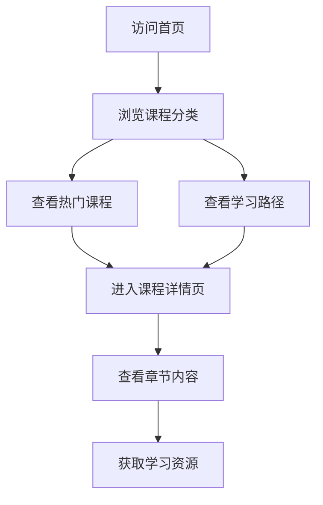

## 1. Product Overview
商务数据分析训练平台是一个纯静态的在线学习平台，专注于提供数据分析相关课程。
- 主要面向希望提升数据分析技能的商务人士、学生和职场新人
- 提供系统化的课程体系，从基础到进阶，帮助用户掌握数据分析核心技能

## 2. Core Features

### 2.1 User Roles
| Role | Registration Method | Core Permissions |
|------|---------------------|------------------|
| Guest User | No registration required | Browse courses, view course details |

### 2.2 Feature Module
1. **首页**: 平台介绍、课程分类、热门课程推荐、学习路径
2. **课程详情页**: 课程内容、章节列表、学习资源
3. **关于我们**: 平台介绍、团队信息、联系方式

### 2.3 Page Details
| Page Name | Module Name | Feature description |
|-----------|-------------|---------------------|
| 首页 | Hero区域 | 平台标语、核心价值主张、立即开始按钮 |
| 首页 | 课程分类 | 展示不同类别的课程，如Python基础、数据分析技术等 |
| 首页 | 热门课程 | 展示最受欢迎的课程卡片 |
| 首页 | 学习路径 | 推荐的学习顺序和路径 |
| 课程详情页 | 课程介绍 | 课程概述、目标受众、学习成果 |
| 课程详情页 | 章节列表 | 详细的章节内容和学习材料 |
| 课程详情页 | 学习资源 | 提供相关的学习资料和工具链接 |
| 关于我们 | 平台介绍 | 平台的使命、愿景和价值观 |
| 关于我们 | 团队信息 | 核心团队成员介绍 |
| 关于我们 | 联系方式 | 联系表单和社交媒体链接 |

## 3. Core Process
用户访问平台 → 浏览课程分类 → 选择感兴趣的课程 → 查看课程详情 → 开始学习

## 4. User Interface Design
### 4.1 Design Style
- 主色调: 深蓝色 (#1E40AF) 和浅蓝色 (#3B82F6)，象征专业和信任
- 辅助色: 橙色 (#F97316) 用于强调和按钮
- 按钮风格: 圆角矩形，有轻微的阴影效果
- 字体: 主标题使用 Inter，正文使用 Roboto
- 字体大小: 标题 24-32px，副标题 18-24px，正文 14-16px
- 布局风格: 卡片式布局，清晰的层次结构
- 图标风格: 线性图标，简洁现代

### 4.2 Page Design Overview
| Page Name | Module Name | UI Elements |
|-----------|-------------|-------------|
| 首页 | Hero区域 | 大型背景图片，渐变叠加，醒目的标题和副标题，CTA按钮 |
| 首页 | 课程分类 | 网格布局的分类卡片，每个卡片包含图标和分类名称 |
| 首页 | 热门课程 | 横向滚动的课程卡片，包含课程缩略图、标题、简介和评分 |
| 首页 | 学习路径 | 时间线形式的学习步骤，清晰的视觉引导 |
| 课程详情页 | 课程介绍 | 课程封面图，标题，简介，标签，进度条 |
| 课程详情页 | 章节列表 | 可折叠的章节，每个章节包含标题和内容概述 |
| 课程详情页 | 学习资源 | 资源卡片，包含资源类型、名称和下载链接 |
| 关于我们 | 平台介绍 | 分栏布局，左侧文字介绍，右侧图片展示 |
| 关于我们 | 团队信息 | 网格布局的团队成员卡片，包含照片、姓名和职位 |
| 关于我们 | 联系方式 | 简洁的联系表单，社交媒体图标链接 |

### 4.3 Responsiveness
- 桌面优先设计，响应式适配平板和移动设备
- 移动设备上采用单列布局，优化触摸交互
- 导航栏在移动设备上转为汉堡菜单
- 图片和卡片布局会根据屏幕尺寸自动调整

### 4.4 3D Scene Guidance
- 无3D场景需求