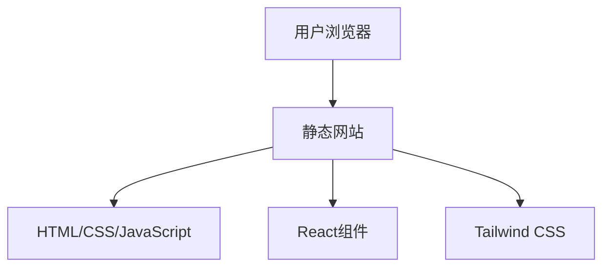

## 1. Architecture Design

## 2. Technology Description
- Frontend: React@18 + Tailwind CSS@3 + Vite
- Initialization Tool: Vite
- Backend: None (纯静态网站)
- Database: None (纯静态网站)

## 3. Route Definitions
| Route | Purpose |
|-------|---------|
| / | 首页，展示平台介绍和课程分类 |
| /courses/:id | 课程详情页，展示课程内容和章节 |
| /about | 关于我们页面，展示平台信息和团队 |

## 4. API Definitions
- 无API需求，纯静态网站

## 5. Server Architecture Diagram
- 无后端架构，纯静态网站

## 6. Data Model
- 无数据库需求，使用静态数据

### 6.1 Data Model Definition
- 课程数据: 包含课程ID、标题、描述、分类、缩略图、章节列表等
- 分类数据: 包含分类ID、名称、图标等
- 团队成员数据: 包含成员姓名、职位、简介、照片等

### 6.2 Data Definition Language
- 无DDL需求，使用静态JSON数据